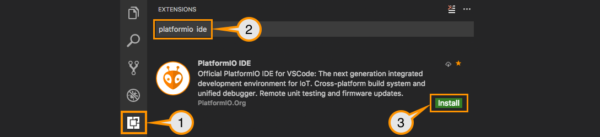

# pioarduino (p)eople (i)nitiated (o)ptimized (arduino)
# Fork of Platformio Espressif 32: development platform for [PlatformIO](https://platformio.org)

[](https://github.com/pioarduino/platform-espressif32/actions)
[](https://discord.gg/Nutz9crnZr)
[](https://github.com/pioarduino/platform-espressif32/releases/latest)

> [!NOTE]  
> This fork was created due to the lack of ongoing development for the Espressif 32 Arduino Core for PlatformIO.
>
> For additional information, please refer to these GitHub links:
> 
> https://github.com/espressif/arduino-esp32/discussions/10039
> https://github.com/platformio/platform-espressif32/issues/1225
> https://github.com/espressif/arduino-esp32/pull/8606
>
> The discussions are self-explanatory, allowing you to draw your own conclusions.

ESP32 is a series of low-cost, low-power system on a chip microcontrollers with integrated Wi-Fi and Bluetooth. ESP32 integrates an antenna switch, RF balun, power amplifier, low-noise receive amplifier, filters, and power management modules.

* [Documentation](https://docs.platformio.org/page/platforms/espressif32.html) (advanced usage, packages, boards, frameworks, etc.)
* Issues with boards (wrong / missing). All issues caused from boards will **not** be fixed from the maintainer(s). A PR needs to be provided to solve.

## IDE Preparation

- [Download and install official Microsoft Visual Studio Code](https://code.visualstudio.com/). PlatformIO IDE is built on top of it.
- Open the extension manager.
- Search for the official `platformio ide` extension.
- Install PlatformIO IDE extension.



# Usage
1. Setup new VSCode PlatformIO project.
1. Configure a platform option in [platformio.ini](https://docs.platformio.org/page/projectconf.html) file:

### Stable version
espressif Arduino 3.0.5 and IDF 5.1.4+

See `platform` [documentation](https://docs.platformio.org/en/latest/projectconf/sections/env/options/platform/platform.html#projectconf-env-platform) for details.

```ini
[env:stable]
platform = https://github.com/pioarduino/platform-espressif32/releases/download/51.03.05/platform-espressif32.zip
board = ...
...
```

### Development version
espressif Arduino repo branch master and latest compiled Arduino libs

```ini
[env:development]
platform = https://github.com/pioarduino/platform-espressif32.git#develop
board = ...
...
```

# Configuration

Please navigate to [documentation](https://docs.platformio.org/page/platforms/espressif32.html).
